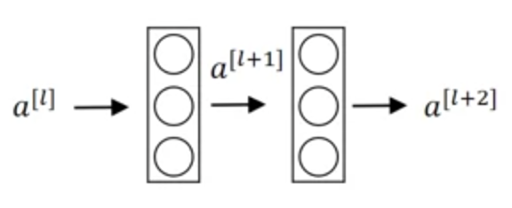
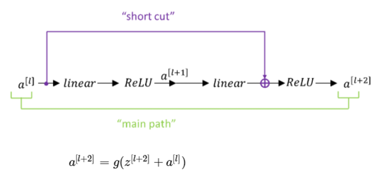
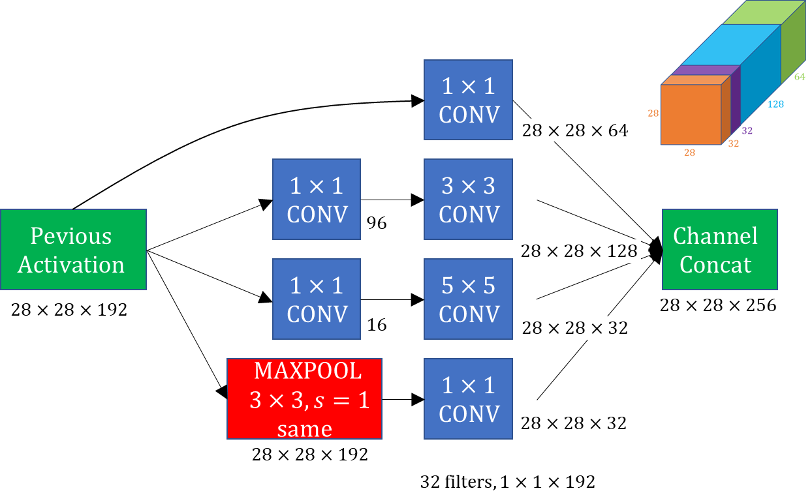
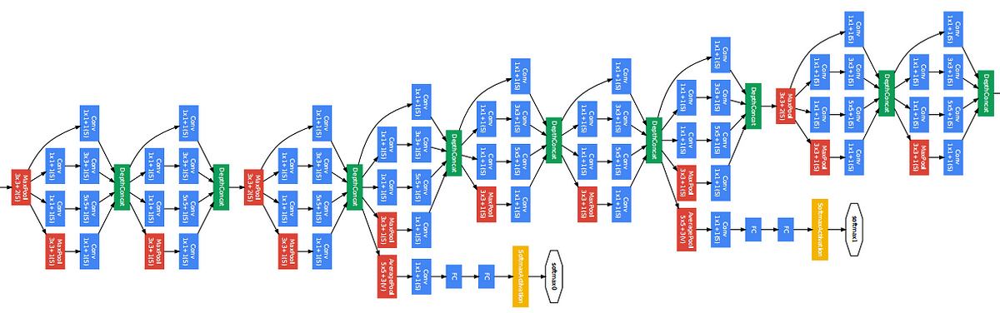
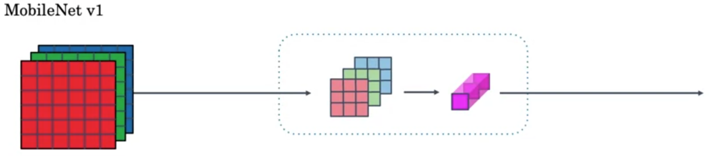
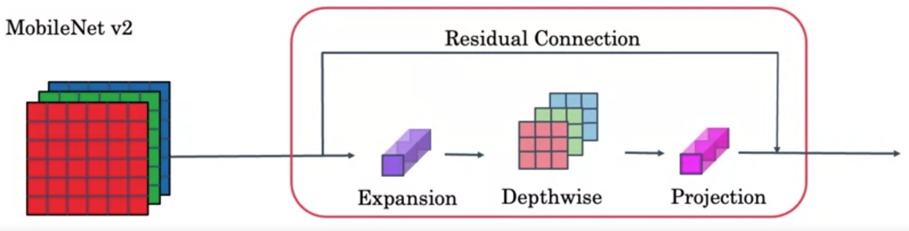

# week2 - Deep Convolutional Models: Case Studies

### Summary
> Discover some powerful practical tricks and methods used in deep CNNs, straight from the research papers, then apply transfer learning to your own deep CNN
> - Learning Objective
>   - Implement the basic building blocks of ResNet in a deep neural network using Keras
>   - Train a state-of-the-art neural network for image classification
>   - Implement a skip connection in your network
>   - Create a dataset from a directory
>   - Preprocess and augment data using the Keras Sequential API
>   - Adapt a pretrained model to new data and train a classifier using Functional API and MobileNet
>   - Fine-tune classifier's final layers to improve accuracy

### Table of Contents
1. [Case Studies](#1)
	- 1-1. [Why look at case studies?](#1-1)
	- 1-2. [Classic Networks](#1-2)
	- 1-3. [ResNets](#1-3)
	- 1-4. [Why ResNets work?](#1-4)
	- 1-5. [Networks in Networks and 1 x 1 Convolutions](#1-5)
	- 1-6. [Inception Network Motivation](#1-6)
	- 1-7. [Inception Network](#1-7)
	- 1-8. [MobileNet](#1-8)
	- 1-9. [MobileNet Architecture](#1-9)
	- 1-10. [EfficientNet](#1-10)
2. [Practical Advice for Using ConvNets](#2)
	- 2-1. [Transfer Learning](#2-1)
	- 2-2. [Data Augmentation](#2-2)
	- 2-3. [State of Computer Vision](#2-3)

## 1. Case Studies

### 1-1. Why look at case studies?

For many years, computer vision researcher has significantly focused on combining basic building blocks such as convolutional layers, pooling layers, and fully connected layers to form effective convolutional neural networks (CNNs). Understanding case studies of classic and advanced networks can provide insights into architectural innovations and their practical applications. Additionally, models designed for one computer vision task often perform well on outher tasks. By examining successful architectures, we can leverage existing trained networks or architectures for our specific problems.

**Outline**

- Classic Networks
	- LeNet-5
	- AlexNet
	- VGG
- ResNet
- Inception
- MobileNet
- EfficientNet

 

### 1-2. Classic Networks
**LeNet-5**

Reference: [LeCun et al., 1998. Gradient-based learning applied to document recognition]

LeNet-5, an early and influential CNN, was designed primarily for handwritten digit recognition. This network introduced key ideas that are foundational to modern CNNs.

- **Activations**: Sigmoid/tanh (instead of ReLU)
- **Pooling**: Average pooling (instead of max pooling)
- **Architecture**:
	- Input: (32, 32, 1)
	-  CONV(filters=6, kernel_size=5, stride=1) $\rightarrow$ AVGPOOL(kernel_size=2, stride=2)
	-   CONV(filters=16, kernel_size=5, stride=1) $\rightarrow$ AVGPOOL(kernel_size=2, stride=2)
	- FC(units=120)
	- FC(units=84)
	- Softmax(units=10)
- **Parameters**: $\approx$ 60,000

The height and width tend to go down whereas the number of channels increases as you go deeper into the layers of the network. and there was non-linearity after pooling back then.

**AlexNet**

Reference: [Krizhevsky et al., 2012, ImageNet classification with deep convolutional neural network]

AlexNet significantly improved the performance of ImageNet classification and introduced several innovations.

- **Activation**: ReLU
- **Architecture**:
	- Input: (227, 227, 3)
	- CONV(filters=96, kernel_size=11, stride=4) $\rightarrow$ MAXPOOL(kernel_size=3, stride=2)
	-   CONV(filters=256, kernel_size=5, padding='same') $\rightarrow$ MAXPOOL(kernel_size=3, stride=2)
	-   CONV(filters=384, kernel_size=3, padding='same')
	-   CONV(filters=384, kernel_size=3, padding='same')
	-   CONV(filters=256, kernel_size=3, padding='same') $\rightarrow$ MAXPOOL(kernel_size=3, stride=2)
	- FC(units=9216) 
	- FC(units=4096) 
	- FC(units=4096) 
	- Softmax(units=1000)
- **Parameters**: $\approx$ 60 million
- **Key Innovations**:
	- Use of Multiple GPUs (2)
	- Local Response Normalization (LRN)

**VGG - 16**

Reference: [Simonyan & Zisserman 2015. Very deep convolutional networks for large-scale image recognition]

VGG-16 simplified the architecture with a focus on using smaller convolutional filters.
- **Architecture**:
	- Input: (224, 224, 3)
	- CONV(filters=64, kernel_size=3, stride=1, padding='same') $\rightarrow$ CONV(filters=64, kernel_size=3, stride=1, padding='same') $\rightarrow$ MAXPOOL(kernel_size=2, stride=2)
	-   CONV(filters=128, kernel_size=3, stride=1, padding='same') $\rightarrow$ CONV(filters=128, kernel_size=3, stride=1, padding='same') $\rightarrow$ MAXPOOL(kernel_size=2, stride=2)
	-   CONV(filters=256, kernel_size=3, stride=1, padding='same') $\rightarrow$ CONV(filters=256, kernel_size=3, stride=1, padding='same') $\rightarrow$ CONV(filters=256, kernel_size=3, stride=1, padding='same') -> MAXPOOL(kernel_size=2, stride=2)
	-   CONV(filters=512, kernel_size=3, stride=1, padding='same') $\rightarrow$ CONV(filters=512, kernel_size=3, stride=1, padding='same') $\rightarrow$ CONV(filters=512, kernel_size=3, stride=1, padding='same') -> MAXPOOL(kernel_size=2, stride=2)
	-   CONV(filters=512, kernel_size=3, stride=1, padding='same') $\rightarrow$ CONV(filters=512, kernel_size=3, stride=1, padding='same') $\rightarrow$ CONV(filters=512, kernel_size=3, stride=1, padding='same') -> MAXPOOL(kernel_size=2, stride=2)
	-   FC(units=4096)
	-   FC(units=4096)
	-   Softmax(units=1000)
- **Parameters**: $\approx$ 138 million

It simplifies the neural network architecture by using the same CONV and MAXPOOL with different numbers of filters
- CONV(kernel_size=3, stride=1, padding="same")
- MAXPOOL(kernel_size=2, stride=2)

The number 16 refers to the fact it has 16 layers that have weights and the architecture is quite uniform.

 

### 1-3. ResNets

Reference: [He et al., 2015, Deep residual networks for image recognition]

Deeper networks often face training difficulties due to vanishing or exploding gradients. ResNets address this issue with residual connection (skip connection) that helps maintain gradient flow.

It allows you to take the activation from one layer and suddenly feed it to another layer even much deeper in the neural network.

**Residual block**

  

$a^{[l]} \rightarrow$ Linear  $\xrightarrow{z^{[l+1]} = W^{[l+1]}a^{[l]} + b^{[l+1]}}$ ReLU $\xrightarrow{a^{[l+1]} = g(z^{[l+1]})}$ Linear $\xrightarrow{z^{[l+2]} = W^{[l+2]}a^{[l+1]} + b^{[l+2]}}$ ReLU $\xrightarrow{a^{[l+2]} = g(z^{[l+2]})}$ $a^{[l+2]}$

where $g$ is the corresponding activation function

**Using skip connection**

  

the short cut of $a^{[l]}$ is added before the activation function to calculate $a^{[l+2]}$

$$a^{[l+2]} = g(z^{[l+2]} + a^{[l]})$$

 

### 1-4. Why do ResNets work?

In the previous example, if weights are decaying to 0, the $z^{[l+2]}$ terms will disappear then the $a^{[l+2]}$ is the same as $a^{[l]}$ with ReLU activation function.

$$a^{[l+2]} = g(z^{[l+2]} + a^{[l]}) \\ = g(W^{[l+2]}a^{[l+1]} + b^{[l+2]} + a^{[l]}) \\ = g(\cancel{ W^{[l+2]}}a^{[l+1]} + \cancel{b^{[l+2]}} + a^{[l]}) \\ = g(a^{[l]}) \\ = a^{[l]}$$

It works as a identify function that is easy for residual block to learn.

 

### 1-5. Networks in Networks and 1 x 1 Convolutions

Reference: [Lin et al. 2013 Network in network]

In terms of designing ConvNet architectures, one of the ideas that helps is using one-by-one convolution.

**Why does a 1 x 1 convolution do?**

You can use 1 x 1 convolution to shrink channels without modifying height and width to save on computation in networks or even keep them the same, in this case, it has non-linearity, allowing you to learn more complex functions of the network by adding another layer. It is also called network in network since when you apply a volume of 1 x 1 convolution to a input, it performs as if it takes the number of channels as neurons or units then multiply the filter values as weights and sum them up.

It is used to shrink channels $n_c$ compared to pooling to shrink height and width $n_H$, $n_W$.

 

### 1-6. Inception Network Motivation

Reference: [Szegedy et al. 2014. Going deeper with convolutions]

**Motivation for inception network**

The basic idea is that instead of picking one of filter sizes or pooling, you can do them all and concatenate all the outputs, and let the network learn whatever parameters it want to use, whatever the combinations of filter sizes it wants.

**The problem of computational cost**
<table>
	<tr>
		<th>Type</th>
		<th>Input</th>
		<th>Convolutional Operation</th>
		<th>Output</th>
		<th>Number of Parameters</th>
	</tr>
	<tr>
		<td>Normal convolution</td>
		<td rowspan=2>(28, 28, 192)</td>
		<td>CONV(filters=32, kernel_size=5, padding="same")</td>
		<td rowspan=2>(28, 28, 32)</td>
		<td>28 x 28 x 32 x 5 x 5x 192 = 120M</td>
	</tr>
		<td>Using 1 x 1 convolution</td>
		<td>CONV(filters=16, kernel_size=1, padding="same")    -> CONV(filters=32, kernel_size=5, padding="same")</td>
		<td>(28 x 28 x 16 x 1 x 1 x 192 = 2.4M)     + (28 x 28 x 32 x 5 x 5 x 16 = 10M) = 12.4M</td>
	<tr>
	</tr>
</table>

**Bottleneck layer**

The 1 x 1 convolution is also called bottleneck, which is the smallest part of a bottle, so it is the smallest part of the network

 

### 1-7. Inception Network
**Inception module**

  

**Inception network**

  

 

### 1-8. MobileNet

Reference: [Haward et al. 2017, MobileNets: Efficient Convolutional Neural Networks for Mobile Vision Applications]

  

**Motivation for MobileNets**

MobileNets focus on low computational cost, suitable for mobile and embedded applications.

- Low computational cost at deployment
- Useful for mobile and embedded vision applications
- Key idea: Normal vs depthwise-separable convolutions

**Normal convolutions**

example:  (6, 6, 3) * (3, 3, 3) = (4, 4, 5)

where $n_c^{'}$ = 5

$\underbrace{\text{computational cost}} _{2160} = \underbrace{\text{number of filter parameters}} _{3 \times 3 \times 3} \times \underbrace{\text{number of filter positions}} _{4 \times 4} \times \underbrace{\text{number of filters}} _{5}$

**Depthwise Separable Convolution**

There are two steps compared to normal convolutions; depthwise and pointwise

- Depthwise Convolution: (6, 6, 3) * (3, 3) = (4, 4, 3)

where $n_c$ = 3 and $n_c{'}$ = 1

$\underbrace {\text{computational cost}} _{432} = \underbrace{\text{number of filter parameters}} _{3 \times 3} \times \underbrace{\text{number of filter positions }\times \text{number of filters}} _{4 \times 4 \times 3}$

- Pointwise Convolution: (4, 4, 3) * (1, 1, 3) = (4, 4, 5)

where $n_c$ = 3 and $n_c{'}$ = 5

$\underbrace{\text{computational cost}} _{240}  = \underbrace{\text{number of filter parameters}} _{1 \times 1 \times 3} \times \underbrace {\text{number filter positions}} _{4 \times 4} \times \underbrace {\text{number of filters}} _{5}$

**Cost Summary**

Cost of normal convolution: 2160

Cost of depthwise separable convolution: depthwise (432) + pointwise (240) = 672

Cost ratio between normal and depthwise separable convolutions

$$\frac {1} {n_c^{'}} + \frac {1} {f^2}$$

$\frac {672} {2160}$ = $\frac {1} {5} + \frac {1} {9}$ = 0.31

 

### 1-9. MobileNet Architecture
Reference: [Sandler et al. 2019, MobileNet V2: Inverted Residuals and Linear Bottlenecks]

  

**MobileNet v2 Bottleneck block**

- Expansion: Increases the size of the representation, allowing the neural network to learn a richer function
- Depthwise Convolution: Operates on each channel separately
- Projection: Reduces the size of the representation

 

### 1-10. EfficientNet

Reference: [Tan and Le, 2019, EfficientNet: Rethinking Model Scaling for Convolutional Neural Networks]

EfficientNet scales the network efficiently by adjusting some values of R, D, and W using baseline network

- R: Resolution of the input image
- D: Depth of the neural network
- W: Width of the output

For example, Higher resolution, Deeper, Wider, or Compound scaling

Given a computational budget, what's the good choice of R, D, and W?
 

## 2. Practical Advice for Using ConvNets

### 2-1. Transfer Learning
Transfer learning is a powerful technique in deep learning, especially when you lack a large dataset to train a model from scratch. Here's how to effectively use transfer learning in computer vision tasks:

1. **Using Pretrained Models**:
- Scenario: You don't have enough data to train a model from scratch
- Action: Download a pretrained model (e.g., trained on ImageNet). Remove the output layer and replace it with a new layer suited to your specific probelm. Treat the rest of the network as frozon (i.e., do not update the weights during training).

2. **Fine-Tuning**:
- Scenario: The number of classes you want to classify is greater than the pretrained model's output layer 
- Action: Instead of freezing the entire network, keep the last few layers (including the output layer) trainable to adjust them appropriately for your own task. This allows the model to adapt better to your specific problem

3. **Full Network Training**:
- Scenario: You have a lot of data
- Action: Retrain the entire network, including the pretrained layers. This can lead to better performance since the model will be fully adapted to your data=

**pre-compute method**
- Scenario: When computational resources are limited
- Action: Consider the fronzen part of the network as a fixed function. Pre-compute the activations of all examples and save them to disk. During training, use this pre-computed activations instead of recomputing them every time, saving computation.

 

### 2-2. Data Augmentation
Data augmentation is essential to enhance the diversity of your training data without actually collecting more data. This helps prevent overfitting and improves the generalization of your model.

Common augmentation method:
- **Mirroring**: Filp the image horizontally
- **Random** Cropping: Randomly crop a portion of the image and resize it to original size
- **Rotation**: Rotate the image by a random angle
- **Shearing**: Apply a shearing transformation to the image
- **Local Warping**: Distort a small region of the image
- **Color Shifting**: Adjust the color blance of the image
	- PCA color augmentation

 

### 2-3. State of Computer Vision
In computer vision, success often comes from leveraging both data and well-engineered models.

**Tips for doing well on benchmarks/winning competitions**

**Ensembling**
- Train serveral networks independently and average their outputs

**Multi-crop at test time**
- Run classifier on multiple versions of test images and average results

**Use open source code**
- Use architectures of networks published in the literatrue
- Use open source implementations if possible
- Use pretrained model and fine-tune on your dataset
