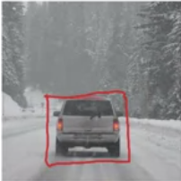

# week3 - Object Detection

### Summary
> Apply your new knowledge of CNNs to one of the hottest (and most challenging) fields in computer vision: object detection.
> - Learning Objectives
>   - Identify the components used for object detectioin (landmark, anchor, bounding box, grid, ...) and their purpose
>   - Implement object detection
>   - Implement non-max suppression to increase accuracy
>   - Implement intersection over union
>   - Handle bounding boxes, a type of image annotation popular in deep learning
>   - Apply sparse categorical crossentropy for pixelwise prediction
>   - Implement semantic image segematation for CARLA self-driving car dataset
>   - Explain the difference between a regular CNN and a U-net
>   - Build a U-net

### Table of Contents
1. [Detection Algorithms](#1)
	- 1-1. [Object Localization](#1-1)
	- 1-2. [Landmark Detection](#1-2)
	- 1-3. [Object Detection](#1-3)

## Detection Algorithms

### 1-1. Object Localization
#### What are localization and detection?

|Types|Image Classification |Classification with Localization |Detection|
|--|--|--|--|
|Definition|Analyzing an image to identify a single class|- Identifying a single object and marking its location within the image.   - Localization refers to figuring out where the object is located in the image|Identifying and locating multiple objects within an image, which includes localization.|
|Number of objects|1 object|1 object|Multiple objects|

#### Classification with localization
In normal classification tasks, a neural network outputs a vector of possible objects at the output layer using the softmax function.

With localization, we modify the output layer to include additional output units for the bounding box, which contains $b_x$, $b_y$ (midpoint), $b_h$ (height), and $b_w$ (width).

#### Defining the target label $y$
||Class|
|--|--|
|1|Pedestrian|
|2|Car|
|3|Motocycle|
|4|Background|
Need to output $b_x, b_y, b_h, b_w$, class label (1-4)

$$y = \begin{bmatrix}
p_c \\
b_x \\
b_y \\
b_h \\
b_w \\
c_1 \\
c_2 \\
c_3
\end{bmatrix}$$

where,
- $p_c$:  indicates the presence of an object (1 if present, 0 if absent)
- $b_x, b_y, b_h, b_w$: bounding box parameters
- $c_1, c_2, c_3$: class probabilities for classes 1, 2, and 3 respectively

||Example 1|Example 2|
|--|--|--|
|Image|||
|Target Label $y$|$$y = [1 \\ b_x \\ b_y \\ b_h \\ b_w \\ 0 \\ 1 \\ 0]$$ | $$y = [0 \\ ? \\ ? \\ ? \\ ? \\ ? \\ ? \\ ? ]$$   where `?` : "Don't care"|

##### Loss Function
$$L(\hat y, y) = (\hat y_1 - y_1)^2 + (\hat y_2 - y_2)^2 + \dots + (\hat y_8 - y_8)^2\text{, if } y_1 = 1$$

$$L(\hat y, y) = (\hat y_1 - y_1)^2\text{, if } y_1 = 0$$

 

### 1-2. Landmark Detection

- Output:  $(l_x, l_y)$ coordinates 

**Definition**: Landmark detection refers to the process of identifying specific points of interests (landmarks) in an image. For example, in facial recognition, landmarks might include the corners of the eyes, the tip of the nose, and the corners of the mouth.

**Purpose**: The main objective is to establish the potition and orientation of an object within a scene. This is essential for tasks that require obejct recognition, tracking, and alignement.

 

### 1-3. Object Detection

#### Sliding windows detection
Sliding windows detection is a technique used in object detection where a fixed-size window moves across the image to identify objects.

1. **Window initialization**: A square or rectangular window of a specific size is defined
2. **Sliding the window**: The window is moved across the image in a systematic manner, staring from the upper-left corner, typically both horizontally and vertically
3. **Classification**: At each position, the content within the window is extracted and passed through a classifier (ConvNet) to determine if an object is present and, if so, what type it is
4. **Output**: The locations of detected objects are recorded, with bounding boxes around the identified objects

We start this process with a smaller window size and then repeat it by increasing the window size.

#### Disadvantage: Computational Cost
you're cropping out so many different square regions in the image and running each of them independently through a ConvNet

One of the disadvantages of the sliding window approach is its high computational cost.

- **Multiple Crop Operations**: The technique involves cropping numerous overlapping regions from the image. Each cropped image is treated as an independent input to the classifier
- **Redundant Computations**: Since many of the cropped windows may contain similar or overlapping content, the classifier processes redundant information multiple times.
 
